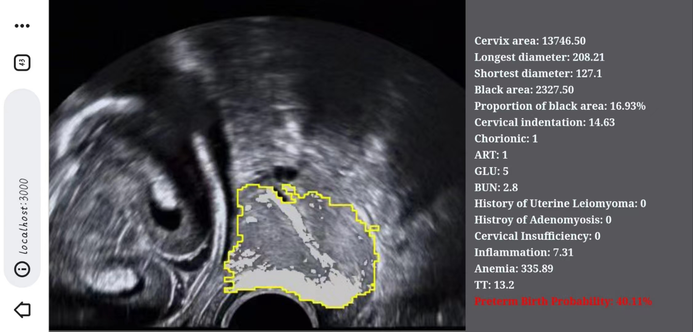
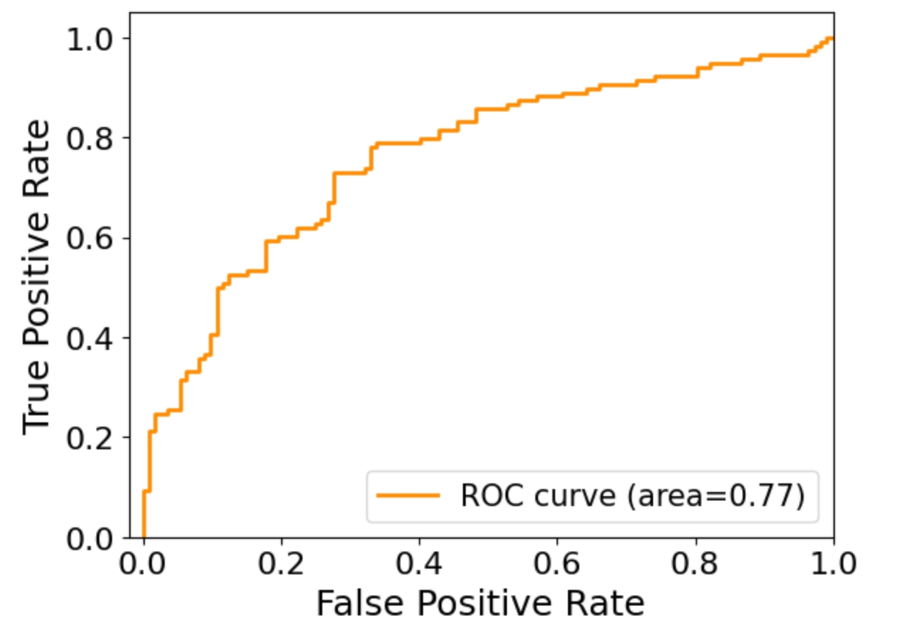
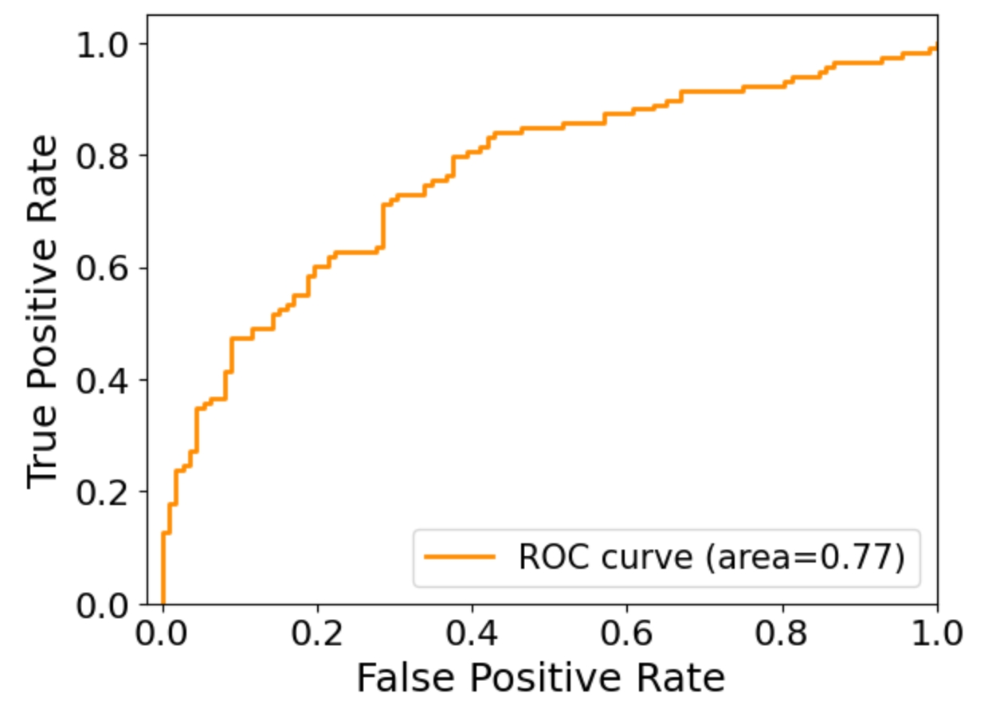

# Web-based AI Assistant for Medical Imaging
<p align = "center">    

</p>


### Summary

We design and implement a web-based assistant
for predicting spontaneous preterm births via ultrasound images.

* During the development phase, we leverage crowdsourcing on the web to annotate ultrasound images and gather domain-specific features to train the AI model for predicting spontaneous preterm birth. 
* During the deployment phase, we employ WebAR to present AI-assisted diagnostic insights for physicians. 

## Getting Started

Clone the repository:

```
git clone https://github.com/ssssszj/Web_Ultrasound.git
cd Web_Ultrasound-master/Web_Ultrasound
```

## Quickstart: Real-world Scenario Testing

We have trained the segmentation model, and you can directly run the browser webpage to test it on real cervical ultrasound images.
Please make sure you have successfully installed Node.js.

```
cd Web_Ultrasound-master/Web_Ultrasound

npm install

npm run build

cd public

npm run start
```


## Train the segment model

The trained segmentation model and classification model and regression model are stored in separate folders named segment_model and classification_model and reg_model.

### Data Format

#### data_feature_together.csv format：

The file named data_feature_together.csv a wide range of parameters crucial for clinical analysis and patient management. It provides a thorough insight into the medical and personal history of the patients, along with detailed laboratory results and diagnostic parameters for better healthcare assessment. Each row in the file corresponds to a unique patient, and the columns include the following details:

* Personal Information:
    Name of the patient
    Outpatient registration number
    Inpatient record number
    Last menstrual period date
    Age
* Medical Diagnosis and History:
    Diagnosis of preeclampsia
    Diagnosis of spontaneous preterm birth
    History of uterine fibroids
    History of adenomyosis
* Pregnancy Details:
    Number of pregnancies
    ART: Assisted reproductive technology usage
    Chorionicity
    Uterine artery notch
    Cervical incompetence
    Various gestational weeks 
* Blood Pressure Measurements:
    Early pregnancy mean arterial pressure
    Mid-pregnancy mean arterial pressure
    Systolic and diastolic pressures for early and mid-pregnancy stages
* Diagnostic Parameters:
    Mid-pregnancy diabetes diagnosis
    Mid-pregnancy cervical length
* Laboratory Results:
    Red blood cells (RBC)
    hematocrit (Hct)
    hemoglobin (Hb)
    white blood cells (WBC)
    neutrophils (NEUT)
    thrombin time (TT)
    prothrombin time (PT)
    activated partial thromboplastin time (APTT)
    fibrinogen (FIB)
    D-dimer
    glucose (GLU)
    low-density lipoprotein (LDL)
    alanine aminotransferase (ALT)
    aspartate aminotransferase (AST)
    albumin (ALB)
    uric acid (UA)
    blood urea nitrogen (BUN)
    serum creatinine (Scr)
    lipoprotein(a) (LPa)
    apolipoprotein A1 (ApoA1)
    apolipoprotein B (ApoB)
    thyroid-stimulating hormone (TSH)
    thyroid peroxidase antibodies (TGAb)
    thyroglobulin antibodies (TMAb)
* Follow-up and Additional Parameters:
    Various logarithmic transformations of the aforementioned values
* Discharge diagnosis description

The file  data_feature_together.csv contains an example.

#### feature_test.txt&&feature_train.txt format:

The dataset used for model training and testing ——— containing an example in the files.

### Begin the train

Please make sure all the requirements in the requirements  are installed.
Please ensure that the format of the dataset you provide meets the requirements.

#### CUnet


##### Train

```
python ./Web_Ultrasound-master/Segment_model/E2EPTB-codes/src/CUnet/train.py --data_path ../your_data_folder --mask_path ../your_mask_folder --annotations_file ../your_annotations_file.csv --num_epochs 500
```

##### Test

```
python ./Web_Ultrasound-master/Segment_model/E2EPTB-codes/src/CUnet/test.py --root /your/mnist/data/directory
```

#### Deeplabv3

Version requirements:
* PyTorch Version:  1.2.0
* Torchvision Version:  0.4.0a0+6b959ee

##### Train&Test

```
python ./Web_Ultrasound-master/Segment_model/E2EPTB-codes/src/Deeplabv3/main.py /path/to/dataset_directory /path/to/experiment_directory --epochs 500 --batchsize 4
```

#### FCN

##### Train&Test

```
python ./Web_Ultrasound-master/Segment_model/E2EPTB-codes/src/FCN/main.py /path/to/dataset_directory /path/to/experiment_directory --epochs 500 --batchsize 4
```


## Regment Model

The regression analysis of training results is implemented in the `./Web_Ultrasound-master/Reg_model/imgprocess.ipynb` file under the folder. During execution, you need to replace the corresponding file paths with your own.

<p align = "center">    

</p>

<p align = "center">    

</p>
