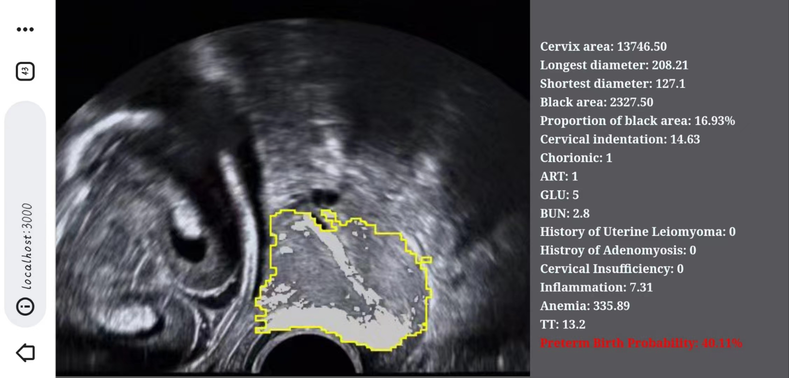

# Web-based AI Assistant for Medical Imaging



## Authors

Weichen Bi, Yun Ma, Zijian Shao, Jiaqi Du, Yudong Han, Yuan Wei, Lijuan Guo, Tianchen Wu and Shuang Li
Peking University

### Summary

We design and implement a web-based assistant
for predicting spontaneous preterm births via ultrasound images.

* During the development phase, we leverage crowdsourcing on the web to annotate ultrasound images and gather domain-specific features to train the AI model for predicting spontaneous preterm birth. 
* During the deployment phase, we employ WebAR to present AI-assisted diagnostic insights for physicians. 

## Getting Started

Clone the repository:

```
git clone https://github.com/ssssszj/Web_Ultrasound.git
cd Web_Ultrasound-master
```

## Quickstart: Real-world Scenario Testing

We have trained the segmentation model, and you can directly run the browser webpage to test it on real cervical ultrasound images.
Please make sure you have successfully installed Node.js.

```
cd Web_Ultrasound-master

npm install

npm run build

cd public

npm run start
```
